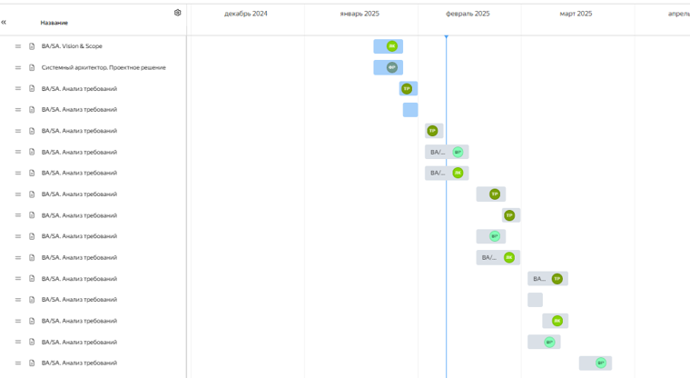
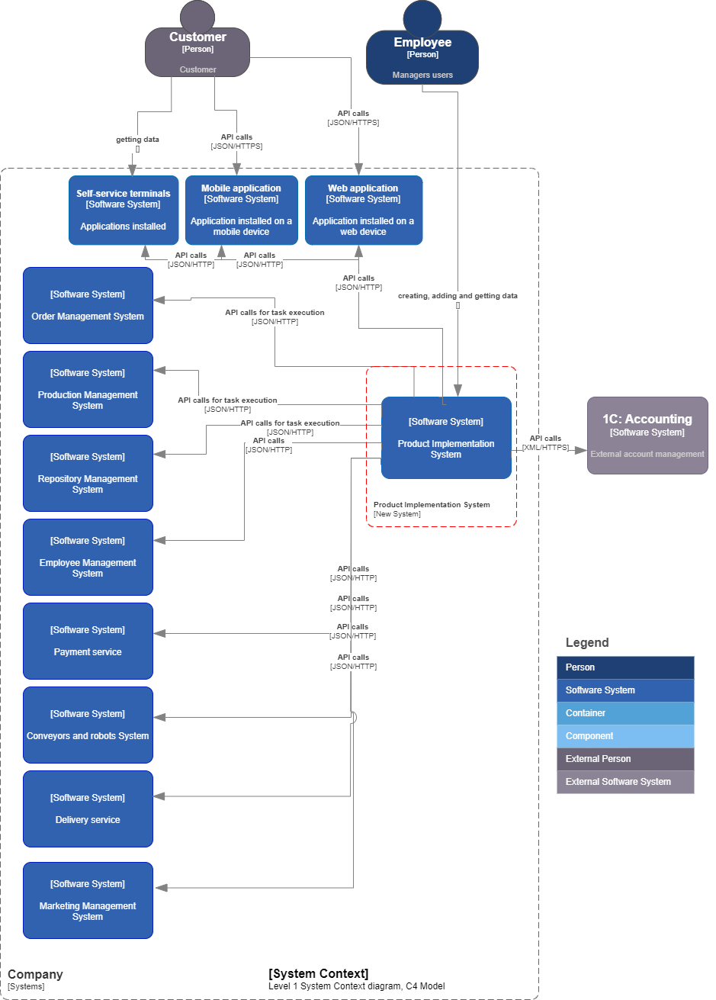
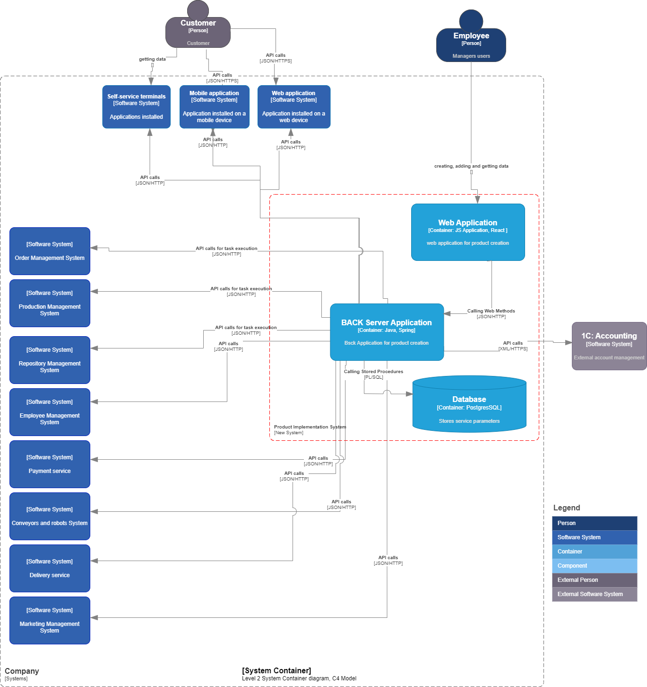
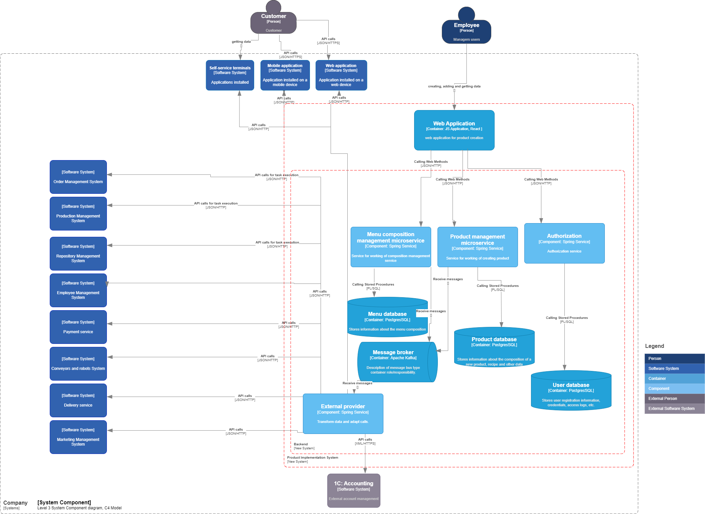
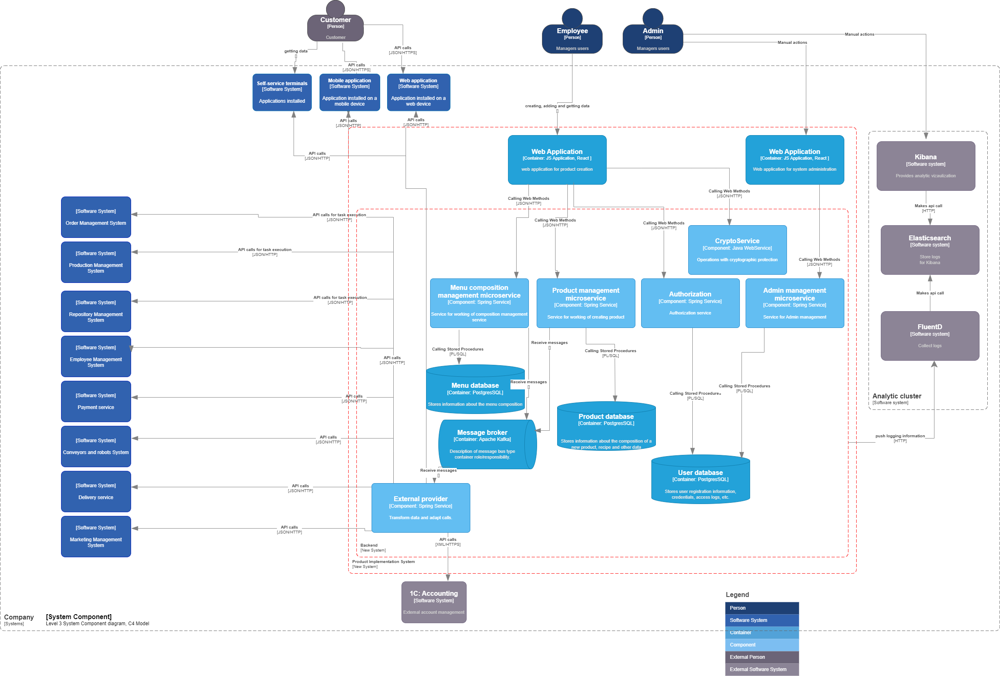

= Проект по разработке системы внедрения новых продуктов в сеть компаний

== Общее описание
Данные требования предоставляют описание реализации механизмов упрощенного внедрения новых продуктов в сеть компаний Заказчика.

Система внедрения нового продукта (Product Implementation System) - программное обеспечение (Платформа) для автоматизации и контроля процесса внедрения новых продуктов, а также взаимодействия сотрудников, упрощения согласования и отслеживания данного процесса. 

Блюдо – продукт для нашего ПО.

== Цели и задачи внедрения проекта
Целями реализации проекта являются:

. Увеличение прибыли за счет ускорения процесса внедрения продукта;
. Повышение конкурентоспособности компании на рынке.
. Предоставление Клиентам услуги онлайн-заказа нового продукта на сайте и мобильном приложении в удобном формате. 

Для осуществления поставленных целей, необходимо реализовать следующие задачи:

* оптимизировать процесс внедрения нового продукта с использованием автоматизации взаимодействия сотрудников;
* систематизировать и документировать процесс;
* спроектировать архитектуру решения;
* разработать, настроить и внедрить решение по оптимизации процесса;
* реализовать инструменты для автоматизации сбора данных, отчетности и доступности всех артефактов для сотрудников компании.

== ИТ-методология для разработки и внедрения, обоснование выбора данной методологии
Для разработки и внедрения проекта по оптимизации процесса внедрения новых продуктов в сети межконтинентальных закусочных «Замысловатость» было принято решение использовать методологию Agile:

* Scrum - для этапа разработки;
* Kanban - для этапа внедрения. 

Agile в целом позволит адаптироваться к различным изменениям на всех этапах проекта, обеспечивая гибкость и постоянное улучшение продукта.

Scrum (для разработки) подойдет для управления разработкой программного обеспечения, так как обеспечит разделение продукта на небольшие итерации (спринты), что позволит команде сосредоточиться на конкретных задачах и регулярно оценивать прогресс. Scrum будет способствовать быстрому реагированию на изменения требований.

Церемонии, которые будут проводиться при разработке проекта:

*	Планирование спринта (Sprint Planning): в начале каждого спринта (2 недели) команда будет обсуждать, какие задачи будут выполнены в текущем спринте, устанавливаются цели и приоритетность задач.

* Дэйли (Daily Stand-ups): каждый рабочий день утром в 10-00 продолжительностью 15 минут, где каждый член команды расскажет, что он сделал вчера, что планирует сделать сегодня и есть ли какие-либо препятствия (блокеры).

* Demo: в конце каждого спринта бизнес-аналитик совместно с тестировщиком демонстрируют завершенные задачи Заказчику, команда собирает обратную связь.

* Ретроспектива спринта (Sprint Retrospective): раз в квартал команда обсуждает, что прошло хорошо, что можно улучшить и разрабатывает планы по улучшению процессов в следующем квартале.

Kanban (для внедрения) позволит визуализировать процесс внедрения, управлять потоком задач и улучшать эффективность команды. Будет поддерживаться непрерывный поток работы и помощь команде быстро реагировать на возникающие проблемы.

Церемонии, которые будут проводиться при внедрении продукта:

* Планирование задач (Task Planning): в начале внедрения будут определяться ключевые задачи и их приоритизация на доске Kanban.

* Регулярные проверки статуса (Status Check-ins): раз в неделю (проведение weekly) с целью обсуждений текущего статуса задач, выявлений узких мест и решений возможных проблем.

== Управление проектом 

Управление проектом будет осуществляться в link [https://tracker.yandex.ru/]

=== Ссылка на проект 

link [ https://tracker.yandex.ru/agile/board/4/sprints?poker=false]

=== Roadmap проекта

=== Команда проекта

.Команда проекта
[cols="2*",options="header"]  
|=== 
|Должность|Количество
|Team Lead системных аналитиков|1
|Системный аналитик|3
|Системный архитектор|1
|BE Разработчик|1
|FE Разработчик|1
|Тестировщик|1
|===

=== Риски проекта

.Технические риски на проекте
[cols="4*",options="header"]  
|=== 
|Потенциальные риски|Вероятность наступления (1 -5)|Последствия|Предлагаемое решение
|Недостаток квалифицированных специалистов и экспертов в технической области|5|Низкое качество выполненной работы. Большое количество ошибок при ПМИ от Заказчика
|Перед началом проекта запланировать обучение для специалистов.
Найм сотрудников с соответствующей экспертизой.
|Проблемы с безопасностью данных и уязвимости в системе|3|Утечка конфиденциальной информации, иски и судебные разбирательства
Потери данных, а также доверия клиентов и партнеров. Необходимость в восстановлении систем и данных
|Использование инструментов для анализа угроз и уязвимостей (SAST и DAST)
Регулярное обновление программного обеспечения и систем безопасности.
Обучение сотрудников, по безопасности данных и осведомленности о киберугрозах
Разработка и тестирование плана действий в случае утечки данных или кибератаки
|===

.Риски оценки сроков
[cols="4*",options="header"]  
|=== 
|Потенциальные риски|Вероятность наступления (1-5)|Последствия|Предлагаемое решение
|Изменение требований и области проекта в процессе работы|3|Необходимость переработки уже выполненной работы
Несоблюдение первоначальных сроков|Согласование спецификации с Заказчиком перед началом этапа разработки.
Планирование времени и ресурсов в план проекта для учета возможных изменений
|Зависимость от внешних вендоров необходимых интеграционных систем|4|Несвоевременное предоставление протоколов взаимодействия со смежными системами от внешних вендоров.
Изменения со стороны вендора могут вызвать проблемы с совместимостью интеграционных систем
|Обсуждение требований и ожиданий с Заказчиком. Планирование тестирования интеграций. Заключение договорных отношений, по которым отсчет срока реализации, бизнес-анализ и разработка начинаются только после предоставления документации от вендоров интеграционных систем
|===

.Интеграционные риски
[cols="4*",options="header"]  
|=== 
|Потенциальные риски|Вероятность наступления (1-5)|Последствия|Предлагаемое решение
|Проблемы с передачей и обменом данных между различными системами|3|Передача неполной и некорректной информации
Снижение производительности из-за проблем с обменом данными 
|Использование «адаптеров» в архитектуре решения с целью полного маппинга входных и выходных параметров. Планирование тестирования интеграций Определение четких соглашений о том, как данные будут передаваться между системами, включая частоту обновлений и форматы данных
|Проблемы с обучением и поддержкой пользователей при переходе на новую систему|3|Неготовность пользователей принимать новую систему, что приведет к сопротивлению и снижению эффективности работы. Увеличение нагрузки на команду для обучения пользователей
|Включение в оценку затрат на обучение сотрудников. Проведение тренингов. Создание службы поддержки
|===

.Риски приемки продукта, коммерческие риски 
[cols="4*",options="header"]  
|=== 
|Потенциальные риски|Вероятность наступления (1-5)|Последствия|Предлагаемое решение
|Отсутствие необходимых Заказчику функций и возможностей в продукте|3|Увеличение затрат на доработки.
Конфликтные споры с Заказчиком
|Полное согласование спецификаций с Заказчиком. Регулярное проведение демо перед Заказчиком по каждому этапу разработки
|Изменение законодательства и нормативных требований|4|Необходимость адаптации бизнес-процессов. Изменение требований и увеличение сроков разработки
Увеличение нагрузки на юридическую службу Исполнителя
|Мониторинг законодательства с целью последующего управления требованиями.
Заключение договорных отношений с ограничением, что изменение требований по причине изменения  законодательства будет рассматриваться в рамках новых доп соглашений с официальным продлением сроков и пересмотром бюджета проекта
|===

== Описание функциональности нового решения

=== Основные функциональные возможности разрабатываемого ПО:

* Создание и отслеживание статуса задачи по разработке нового продукта;
* Назначение ответственных за выполнением задачи;
* Создание базы данных рецептов с возможностью добавления, изменения, удаления рецептуры;
* Расчет себестоимости продукта, включая стоимость ингредиентов и трудозатрат;
* Создание обучающих материалов и видео по приготовлению нового продукта;
* Получение и передача необходимых данных в смежные системы компании для управления жизненным циклом продукта, а таже во внешние системы. 

Для нового продукта должна быть реализована возможность:

* добавления в меню на официальных сайтах и мобильных приложениях; 

* интеграции в список доступных блюд на терминалах самообслуживания; 

* добавления в систему управления заказами;

* автоматического внесения изменений в систему управления производством на кухне;

* обновления системы управления складом с целью  учета запасов ингредиентов и продуктов, связанных с новым блюдом, автоматического заказа недостающих компоненов и уведомлений о сроках годности;

* учета в системе управления логистикой для отслеживания поставок ингредиентов, контроля качества и сроков годности нового продукта, а также эффективного управления его инвентаризацией;

* настройки автоматического продвижения через социальные сети и другие каналы коммуникации; 

* интеграции в различные платежные системы, позволяющие клиентам производить оплату онлайн и картами при заказе нового продукта в ресторанах;

* использования аналитики данных для анализа реакции клиентов, изучения их предпочтений и поведения при заказе нового блюда;

* внесения изменений в автоматические конвейеры и роботы на кухне;

* интеграция с доставками;

* использования маркетинговых решений, таких как программы лояльности, рекламные кампании в социальных сетях и другие инструменты для привлечения новых клиентов и удержания постоянных.

== Описание архитектурного решения

Описание основных сущностей разрабатываемого ПО (сервиса) и их взаимодействие между собой и другими сервисами для архитектурной схемы С4.

Примечание: (на схеме и в описании указаны системы, с которыми необходимо реализовать взаимодействие при разработке нового ПО)

[cols="1,2"]
|===
| Наименование | Описание взаимодействия
| Сотрудник | Сотрудник компании, который имеет доступ к Платформе в соответствии с ролью согласно Ролевой модели, которая определяет разрешенные действия на Платформе.
| Пользователь | Клиент сети закусочных.
| Веб-приложение (Web Application) | Веб-интерфейс для сотрудника компании, предоставляющее возможность:
- создать продукт (добавить ингредиенты, внести изменения в рецепт (ингредиенты), сохранить, просмотреть, удалить);
- рассчитать себестоимость продукта, включая стоимость ингредиентов и трудозатрат;
- добавить видео и фото (обучающие материалы) по приготовлению нового продукта;
- получить и передать необходимые данные в смежные системы компании для управления жизненным циклом продукта, а также во внешние системы.
Разработка будет вестись на JavaScript с целью работы на всех современных браузерах и устройствах. Также будет использован фреймворк (например, React), что упростит разработку и позволит быстро создать сложное приложение с расширяемой функциональностью.
Интеграция с сервером приложений через REST API (JSON).
|===

=== Описание компонентов Backend части разрабатываемой Системы внедрения нового продукта

==== Общее описание

Сервер приложений будет выполнять свои ключевые функции в архитектуре:

. Выполнение бизнес-логики, которая определяет, как данные обрабатываются и какие действия выполняются на основе запросов от веб-приложения, включая валидацию данных по управлению процессом внедрения новых продуктов, выполнение вычислений себестоимости продукта, его статуса в меню.
. Взаимодействие с базами данных для хранения, извлечения, обновления и удаления данных.
. Обработка запросов (HTTP-запросы от веб-приложения), обработка их и возврат соответствующих ответов в JSON формате.
. Управление процессами аутентификации и авторизации сотрудников компании, проверка прав на управление процессом внедрения продукта.
. Интеграция со смежными системами компании и внешними сервисами (взаимодействие с другими API и внешними сервисами для получения данных или выполнения действий).

Разработка будет на Java с использованием Spring Framework с целью разбиения приложения на модули, что упростит управление зависимостями и улучшит читаемость кода, сделает его тестируемым и гибким. Spring предоставляет инструменты для юнит-тестирования и интеграционного тестирования, а также легко интегрируется с различными технологиями и фреймворками.

Базы данных используются для хранения, управления и обработки данных, обеспечения их целостности, поиска и фильтрации, анализа данных. Будет использоваться PostgreSQL, так как имеет открытый исходный код (можно свободно использовать, модифицировать и распространять его без лицензионных сборов), имеет хорошую масштабируемость, поддерживает создание пользовательских типов данных, функций и операторов, что делает его очень гибким для различных приложений.

==== Описание компонентов

===== Сервис авторизации

Сервис авторизации будет играть ключевую роль в обеспечении безопасности и управления доступом к различным ресурсам и функциям новой системы создания продукта:

* аутентификация (процесс проверки идентичности пользователя с помощью логина и пароля);
* авторизация (процесс определения, какие ресурсы или действия доступны аутентифицированному пользователю, включая управление ролями и правами доступа).

==== База данных пользователей (User database)

База данных пользователей будет выполнять несколько ключевых функций:

* хранение данных о пользователях: ФИО, адреса электронной почты, логины, пароли (в зашифрованном виде), контактные данные и другие атрибуты;
* аутентификация: будет проверять личность пользователей, обеспечивая безопасность доступа к системе;
* авторизация: будет управлять правами доступа пользователей к различным ресурсам и функциям системы;
* отслеживание активности: будет хранить информацию о действиях пользователей в системе для анализа поведения, мониторинга и контроля.

== Нефункциональные требования

=== Описание архитектуры с НФТ

Учет требований к безопасности системы модуля по созданию нового продукта в рамках фреймворка IAF включает в себя системный подход к идентификации, проектированию, реализации, мониторингу и постоянному улучшению мер безопасности

=== Требования к масштабируемости

==== ТМ – 1. 
Система должна поддерживать возможность добавления новых узлов для увеличения вычислительных ресурсов без значительных изменений в архитектуре.
==== ТМ – 2. 
Новые модули должны быть добавлены в систему без изменения существующих компонентов.

=== Требования к производительности

==== ТП – 1. 
Система должна поддерживать одновременное подключение не менее 100 пользователей без ухудшения производительности.

==== ТП – 2. 
Время отклика для критических операций (например, создание нового продукта) не должно превышать 3 секунд при пиковых нагрузках.

==== ТП – 3. 
Система должна быть способна обрабатывать до 1000 транзакций в минуту.

=== Требования к переносимости и совместимости системы

==== ТПС - 1.
Система должна функционировать на основных операционных системах (Windows, macOS, Linux).

==== ТПС - 2.
Приложение должно корректно работать в последних трех мажорных версиях следующих браузеров: Chrome, Firefox, Safari.

==== ТПС - 3.
Система должна поддерживать интеграцию через API с другими системами компании, внешними системами и обмен данными в формате JSON или XML.

==== ТПС - 4.
Кодовая база должна быть написана с учетом переносимости между различными средами разработки и развертывания.

=== Требования к доступности

==== ТД – 1. 
Система должна быть доступна 24/7, за исключением времени регламентных работ и времени на устранение инцидентов.
==== ТД – 2.
Время регламентных работ не должно превышать в общей сумме 8 часов в месяц.
==== ТД – 3. 
Критические и блокирующие инциденты должны быть устранены в течение 3-х часов.

=== Требования к информационной безопасности

==== ИБ – 1. 
Основная часть параметров работы Системы настраиваема и соответствует политике безопасности на серверах Системы.

==== ИБ – 2.
Хранение информации в базах данных должно быть организовано в виде таблиц, с присущими им функциональными зависимостями.

==== ИБ – 3. 
При обработке данных для сохранения целостности и внутренней непротиворечивости баз данных должен использоваться аппарат транзакций (под транзакцией понимается неделимая с точки зрения воздействия на базу данных последовательность операций над данными).

==== ИБ – 4.
Транзакция должна считаться выполненной только в случае успешного выполнения всех промежуточных операций.

==== ИБ – 5. 
Базы данных должны соответствовать требованиям:

* минимизация хранимых данных;
* минимизация времени доступа к данным;
* минимизация затрат на подготовку входных данных для формирования выходных.

==== ИБ – 6. 
В процессе разработки Системы обязательно внедрение принципов безопасной разработки: сканирование SAST и SCA.

==== ИБ – 7. 
Обязателен аудит кода Системы для идентификации уязвимостей, связанных с ошибками.

==== ИБ – 8. 
Обязателен аудит версий используемых сторонних компонентов для идентификации известных уязвимостей (SCA).

==== ИБ – 9. 
Среды разработки и тестирования разделены.

==== ИБ – 10. 
Приемочные испытания проводятся в соответствии с программой и методикой испытаний.

==== ИБ – 11. 
Использование реальных данных в средах тестирования или разработки исключено.

==== ИБ – 12. 
Перед внедрением Системы производятся процедуры:

* удаление тестовых данных и учетных записей;
* статическое сканирование кода на уязвимости (SAST);
* сканирование версий используемых сторонних компонентов на наличие известных уязвимостей (SCA);
* ручной анализ потенциальных уязвимостей, найденных сканерами, для их оценки и при необходимости – исправления;
* по итогам статического анализа кода и SCA-анализа должны быть предоставлены соответствующие отчеты (Developer reports).

==== ИБ – 13. 
Разработчик учитывает требования OWASP TOP10 при разработке Системы.

==== ИБ – 14.
При проведении процедуры обновления Системы или её отдельных модулей (включая внедрение новых) должна быть обеспечена сохранность санкционированных/согласованных дополнений и изменений.

==== ИБ – 15. 
Требования информационной безопасности обеспечиваются на всех этапах процесса взаимодействия между пользователем и Системой.

==== ИБ – 16.
Будут реализованы защита от несанкционированного доступа и регулярное обновление компонентов системы для устранения известных уязвимостей.

==== ИБ – 17
Идентификация и аутентификация пользователей будет реализована с использованием логина и пароля.

==== ИБ – 18
Шифрование каналов связи обеспечивается при помощи протокола HTTPS (с использованием международного TLS 1.2 и выше).

==== ИБ – 19
Доступ к управлению и настройкам системы осуществляется только уполномоченными лицами.

==== ИБ – 20
Система обеспечивает дополнительные средства информационной безопасности:

* возможность настройки автоматического окончания сессии пользователя во время сеанса работы, если пользователь неактивен в течение определенного временного интервала;
* завершение текущей сессии пользователя при выходе из системы;
* возможность настройки ограничения на количество неуспешных авторизаций пользователя и периода автоматической блокировки пользователя;
* автоматическая блокировка пользователя при превышении ограничения на количество неуспешных авторизаций подряд (настраиваемый таймер);
* хранение паролей пользователя в хешированном виде, алгоритм которого определен функциональностью фреймворка Spring для Java.

==== ИБ – 21
Система предоставляет возможность Администратору вручную приостановить или ограничить доступ пользователя к ресурсам системы (заблокировать, закрыть) при наличии достаточных оснований считать, что возможна попытка несанкционированного доступа от имени пользователя.

==== ИБ – 22
Система в обязательном порядке фиксирует внесение Администратором причин блокировки пользователя.

==== ИБ – 23
В системе реализована возможность передачи информации в систему только для авторизованных пользователей. В ходе хранения, обработки и передачи информации по каналам связи система должна обеспечивать защиту информации от нарушения её:

* конфиденциальности;
* целостности;
* подлинности;
* доступности.

==== ИБ – 24
Права и доступы пользователя к функциональности авторизованной зоны определяются на основании его роли.

==== ИБ – 25
На стороне системы доступны настройки правил проверки паролей для использования при создании/изменении пароля:

* обязательное сочетание символов в составе пароля;
* длина пароля;
* сложность пароля;
* при смене пароля — проверка нового пароля на совпадение с несколькими предыдущими.

==== ИБ – 26
При использовании авторизации по логину и паролю пользователь может самостоятельно изменить свой пароль.

==== ИБ – 27
Хранение паролей в открытом виде исключено.

==== ИБ – 28
Системой предусмотрен механизм блокировки входа в систему (на настраиваемый промежуток времени) за превышение установленного количества неуспешных авторизаций подряд с использованием одной учетной записи.

==== ИБ – 29
После завершения процесса создания продукта пользователь должен использовать цифровую подпись для подтверждения своих действий. Это будет включать в себя создание хэш-значения (SHA-256) для данных о новом продукте и его шифрование с помощью закрытого ключа пользователя.

==== ИБ – 30
Система логирует данные всех вызовов API, как внешних, так и внутренних (включая запросы и ответы), и всех системных событий.

==== ИБ – 31
Администратору все данные логирования, а также журнал событий будут представлены с использованием средства для просмотра логов в Elasticsearch.

==== ИБ – 32
В логах системы фиксируются:

* дата и время запроса, время его исполнения;
* идентификатор, логин пользователя;
* IP-адрес;
* параметры запроса и ответа вызова API.

==== ИБ – 33
Журнал учета действий пользователя для Администратора содержит сведения:

* дата и время действия;
* действие пользователя (просмотр изменения статуса пользователя);
* идентификатор пользователя;
* логин пользователя;
* IP-адрес;
* дата последней авторизации пользователя.

==== ИБ – 34
Из системы должны быть исключены функции удаления и редактирования записей журнала учета действий пользователей системы.

==== ИБ – 35
Журнал учета действий пользователей должен храниться в системе и быть доступным с помощью средств Kibana.

=== Иные нефункциональные требования

==== ИТ – 1.
Система должна иметь возможность автоматически настраиваться под изменяющиеся условия эксплуатации и нагрузки.

==== ИТ – 2.
Должна быть обеспечена возможность изменения конфигурации системы для удовлетворения новых бизнес-требований без значительных затрат времени и ресурсов.

==== ИТ – 3. 
Процессы развертывания и обновления должны быть автоматизированы и упрощены для минимизации времени простоя.

==== ИТ – 4. 
Система должна обеспечивать высокую степень надежности, минимизируя количество ошибок и сбоев в работе.

==== ИТ – 5. 
Интерфейс системы должен быть интуитивно понятным и удобным для сотрудников, обеспечивая легкость в обучении и использовании.

== Заключение

Реализация этого проекта позволит выполнить оптимизацию процесса внедрения новых продуктов в сети межконтинентальных закусочных “Замысловатость” с помощью реализацию программного обеспечения (платформы) для автоматизации взаимодействия сотрудников, упрощения процесса согласования и отслеживания внедрения новых продуктов.

Для выполнения целей и задач проекта необходимо подготовить:

* ключевые артефакты проекта:

** Документ требований к производительности: включает в себя метрики и показатели производительности.
** Политики безопасности: описывают меры по обеспечению безопасности данных и соответствия стандартам.
** Программа и методика испытаний.
** Документ совместимости: содержит информацию о поддерживаемых платформах и системах.

* ключевые схемы проекта:

** Архитектурная схема C4: визуализирует архитектуру системы с учетом нефункциональных требований (НФТ), где добавлены:
  *** Роль администратора системы.
  *** Компонент криптосервиса для криптографической защиты операций по созданию новых продуктов.
  *** Взаимодействие с аналитическим кластером с целью логирования всех действий и ведения журнала событий действий пользователей системы.
  *** Взаимодействие с внешними системами с использованием протоколов HTTPS.
  
** Диаграмма потоков данных: показывает, как данные перемещаются через систему и какие меры безопасности применяются.
** Диаграмма интеграции: иллюстрирует взаимодействие системы с внешними компонентами.

